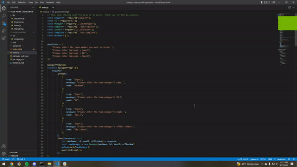

# team-profile-generator

[https://github.com/bobbeekethdy1025/team-profile-generator]

.gif) 
.gif)

## Link to Full Length Video
[https://streamable.com/pub551]

## Description
team-profile-generator is the repository for the 10th challenge assessment that we were given in the bootcamp

Above this text you will find two links that will take you to the repository that was created to store the codes and files for this challenge. The latter link will send you to the full length video that demonstrates the use of the application.

Within the repository you will find all the files that were necessary to create the team profile generator. In order to active the application, you must type in "node index.js" in the terminal.
After which, you will be prompted to enter text according to the dialog that is provided. After all the information is taken, an html will be generated containing all of the information that the user has entered.

Thank you for taking the time to read this.
